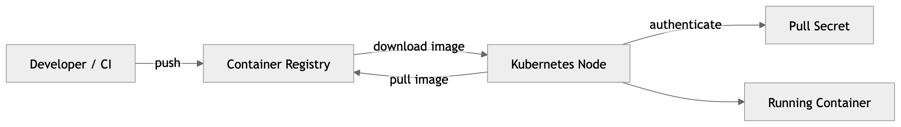
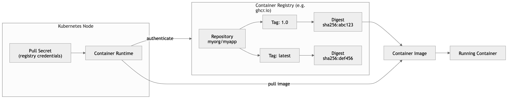

# Container Registry Basics

This section explains the basic concepts involved in working with container images and registries.



## Registry

A registry is a server that stores and distributes container images.

It acts like a package repository for container images. Users can push images to a registry and pull images from it.

Examples of registries:

- GitHub Container Registry (ghcr.io)
- Docker Hub
- Google Artifact Registry
- Amazon Elastic Container Registry

Example registry hostname:

```text
ghcr.io
```

## Repository

A repository is a collection of related container images inside a registry.

Repositories usually contain multiple versions of the same image.

Example repository:

```text
ghcr.io/myorg/myapp
```

This repository may contain several versions of the same image.

## Tag

A tag identifies a specific version of an image within a repository.

Tags are commonly used for:

- version numbers
- release names
- environments

Examples:

```text
ghcr.io/myorg/myapp:1.0
ghcr.io/myorg/myapp:1.1
ghcr.io/myorg/myapp:latest
```

Here:

`myorg/myapp` is the repository.

`1.0`, `1.1`, and `latest` are tags.

Tags are human-readable identifiers pointing to a specific image.

## Digest

A digest uniquely identifies a container image using a cryptographic hash.

Unlike tags, digests are immutable.

Example:

```text
ghcr.io/myorg/myapp@sha256:9f1c9f2c8e...
```

Using digests ensures that the exact same image is used every time.

## Image

A container image is a packaged filesystem and configuration used to run a container.

An image typically contains:

- application code
- runtime environment
- system libraries
- configuration

Images are usually built from a Dockerfile or other container build system.

Example:

```bash
docker build -t ghcr.io/myorg/myapp:1.0 .
```

## Pull

To pull an image means to download it from a registry.

Example:

```bash
docker pull ghcr.io/myorg/myapp:1.0
```

This retrieves the image from the registry to the local machine.

## Push

To push an image means to upload it to a registry.

Example:

```bash
docker push ghcr.io/myorg/myapp:1.0
```

This stores the image in the registry so others can download it.

## Authentication

Most registries require authentication to access private images.

Authentication usually uses:

- a username
- a token or password

Example login:

```bash
docker login ghcr.io
```

## Pull Secret

A pull secret is a credential used by systems (such as Kubernetes) to authenticate to a registry when pulling private images.

Without a pull secret, the system cannot download private images.

Example Kubernetes pull secret:

```bash
kubectl create secret docker-registry ghcr \
  --docker-server=ghcr.io \
  --docker-username=USERNAME \
  --docker-password=TOKEN
```

The secret is then referenced in a Pod or Deployment.

## Image Reference

A full container image reference typically looks like:

```text
REGISTRY/REPOSITORY:TAG
```

Example:

```text
ghcr.io/myorg/myapp:1.0
```

or using a digest:

```text
ghcr.io/myorg/myapp@sha256:abc123...
```

## Container

A container is a running instance of an image.

Example:

```bash
docker run ghcr.io/myorg/myapp:1.0
```

Here:

- the image is the packaged application
- the container is the running process created from that image.

## Summary

```text
Registry
   └── Repository
          └── Image versions
                 ├── Tag (human-readable version)
                 └── Digest (immutable identifier)
```

Example:

```text
ghcr.io/myorg/myapp:1.0
│      │     │     │
│      │     │     └── Tag
│      │     └──────── Repository
│      └────────────── Organization
└───────────────────── Registry
```

Image pull workflow:


