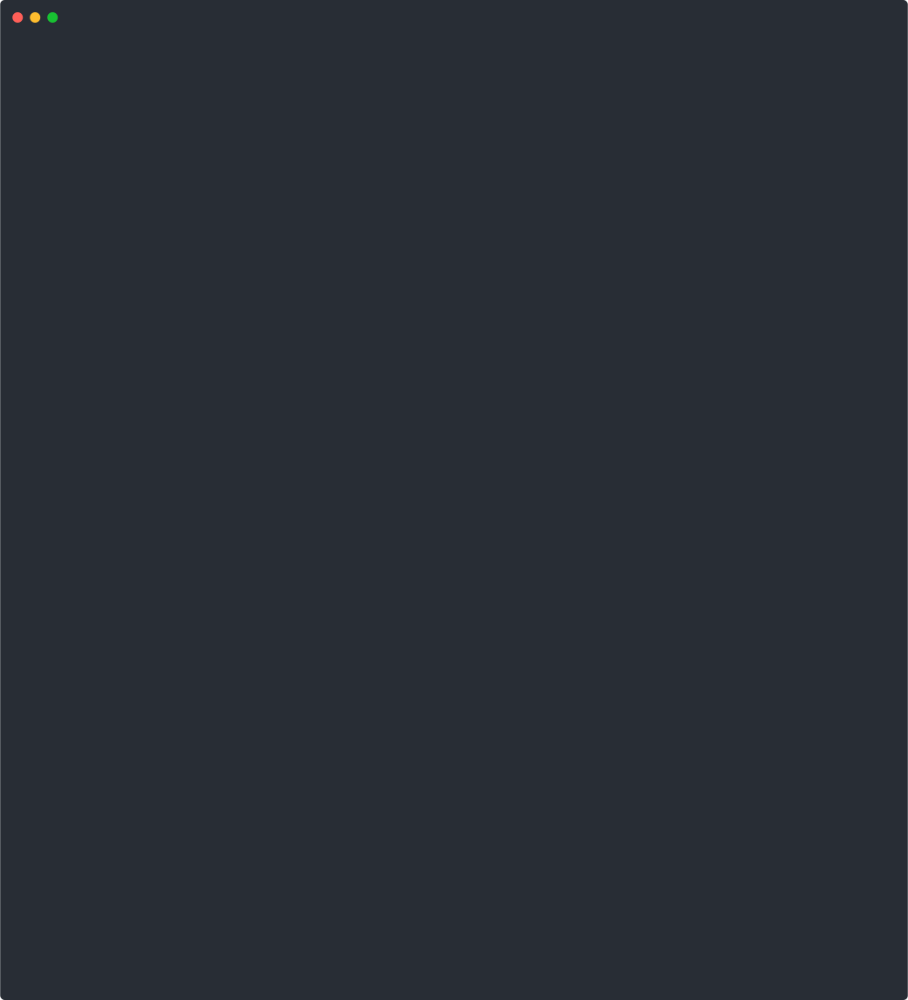

# `scone-td-build` Examples

The **SCONE Trust Domain Build** (`scone-td-build`) transforms cloud-native applications into confidential cloud-native applications.

Check out the following examples to learn more about how `scone-td-build` transforms applications:

- [hello-world](./hello-world/README.md): First, builds the a native `hello-world` program. Second, we transform into a confidential, cloud-native program using command `scone-td-build`. One can run all commands using script `./scripts/hello-world.sh`.

- [configmap](./configmap/README.md): Second, we show how to protect `configmaps` by transforming them into encrypted CAS policies. 

- [web-server](./web-server/README.md): Third, we show how to protect `configmaps` and `secrets` by transforming them into encrypted CAS policies and mapping them as files into a web-server.

