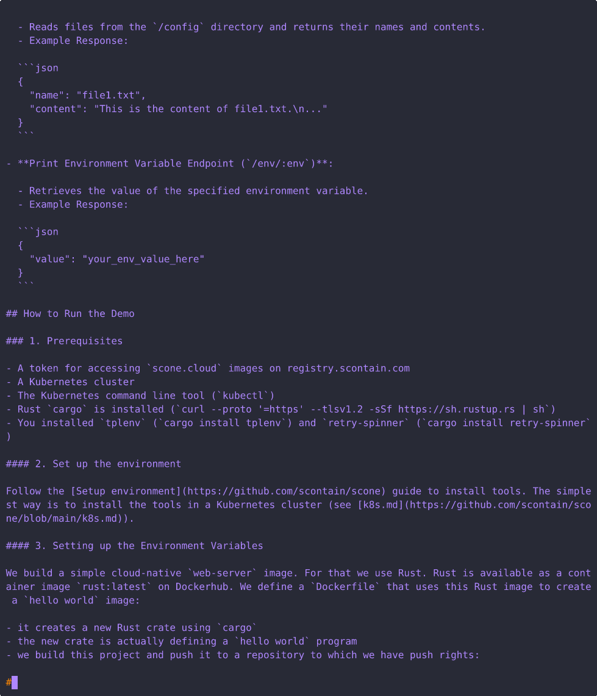

# Web Server Demo (CVM Mode)

## Introduction

This Rust application is a minimal web service built with the [Axum](https://github.com/tokio-rs/axum) framework.
While it is more functional than a traditional "web server" example, it remains straightforward and easy to understand.



## Endpoints

- **Generate Password Endpoint (`/gen`)**:

  - Generates a random password consisting of alphanumeric characters.
  - Example Response:

  ```json
  {
    "password": "aBcD1234EeFgH5678"
  }
  ```

- **Print Path Endpoint (`/path`)**:

  - Reads files from the `/config` directory and returns their names and contents.
  - Example Response:

  ```json
  {
    "name": "file1.txt",
    "content": "This is the content of file1.txt.\n..."
  }
  ```

- **Print Environment Variable Endpoint (`/env/:env`)**:

  - Retrieves the value of the specified environment variable.
  - Example Response:

  ```json
  {
    "value": "your_env_value_here"
  }
  ```

## How to Run the Demo

### 1. Prerequisites

- A token for accessing `scone.cloud` images on registry.scontain.com
- A Kubernetes cluster with CVM support (TDX or SEV-SNP)
- The Kubernetes command line tool (`kubectl`)
- Rust `cargo` is installed (`curl --proto '=https' --tlsv1.2 -sSf https://sh.rustup.rs | sh`)
- You installed `tplenv` (`cargo install tplenv`) and `retry-spinner` (`cargo install retry-spinner`)
- A CAS instance reachable from the cluster (see TDX-DEMO.md for setup)

#### 2. Set up the environment

Follow the [Setup environment](https://github.com/scontain/scone) guide to install tools. The simplest way is to install the tools in a Kubernetes cluster (see [k8s.md](https://github.com/scontain/scone/blob/main/k8s.md)).

#### 3. Setting up the Environment Variables

We build a simple cloud-native `web-server` image. For this, we use Rust. Rust is available as the container image `rust:latest` on Docker Hub. We define a `Dockerfile` that uses this image to create a `web-server` image:

- it creates a new Rust crate using `cargo`
- the new crate defines the `web-server` program
- we build this project and push it to a repository where we have push access:

```bash
# Ensure we are in the correct directory. We assume we start in `scone-td-build-demos`.
pushd web-server
```

The default values of several environment variables are defined in file `Values.yaml`.
`tplenv` asks whether all defaults are okay. It then sets the environment variables:

 - `$IMAGE_NAME` - name of the native container image to deploy the `web-server` application,
 - `$DESTINATION_IMAGE_NAME` - destination of the confidential container image
 - `$IMAGE_PULL_SECRET_NAME` - the name of the pull secret used to pull this image (default: `sconeapps`). For simplicity, we assume we can use the same pull secret for both the native and confidential workloads.
 - `$SCONE_VERSION` - the SCONE version to use (7.0.0-alpha.1 for now)
 - `$CAS_NAMESPACE` - the CAS namespace to use (e.g., `default`)
 - `$CAS_NAME` - The CAS name to use (e.g., `cas`)
 - `$CVM_MODE` - set to `--cvm` for CVM mode.
 - `$SCONE_ENCLAVE` - set to `--scone-enclave` for confidential Kubernetes nodes.
 - `$CAS_EXTERNAL_IP` - the external IP address of the CAS instance on the SGX cluster.

Program `tplenv` asks the user whether to keep the current (default) configuration stored in `Values.yaml`.
Note that `Values.yaml` has priority over environment variables.
If the user changes values, they are written to `Values.yaml`.

`tplenv` will now ask for all environment variables described in `environment-variables.md`:

```bash
eval $(tplenv --file environment-variables.md --create-values-file --eval ${CONFIRM_ALL_ENVIRONMENT_VARIABLES} --output  /dev/null )
```

We encrypt the policies that we send to CAS to ensure the integrity and confidentiality of the policies. To do so, we need to attest the CAS:

```bash
# attest the CAS - to ensure that we know the correct session encryption key
scone cas attest ${CAS_EXTERNAL_IP}:8081 --accept-configuration-needed --accept-group-out-of-date --accept-sw-hardening-needed --mrsigner 195e5a6df987d6a515dd083750c1ea352283f8364d3ec9142b0d593988c6ed2d --isvprodid 41316 --isvsvn 5
```

Next, we need to customize the job manifest to set the right image name (`$IMAGE_NAME`) and the right pull secret (`$IMAGE_PULL_SECRET_NAME`):

```bash
# customize the job manifest
tplenv --file manifest.template.yaml --create-values-file --output  manifest.yaml
```

4. **Register image**

Now, we create the native `web-server` application using Rust.

```bash
# Build the Scone image for the demo client
docker build -t ${IMAGE_NAME} .

# Push it to the registry
docker push ${IMAGE_NAME}
```

When transforming the binaries in the container image for confidential computing, we sign the binaries with a key. `scone-td-build` assumes, by default, that this key is stored in file `identity.pem`. We can generate this file as follows:

- we first check if the file exists, and
- if it does not exist, we create it with `openssl`

```bash
if [ ! -f identity.pem ]; then
  echo "Generating identity.pem ..."
  openssl genrsa -3 -out identity.pem 3072
else
  echo "identity.pem already exists."
fi
```

```bash
scone-td-build register \
    --protected-image ${IMAGE_NAME} \
    --unprotected-image ${IMAGE_NAME} \
    --destination-image ${DESTINATION_IMAGE_NAME} \
    --push \
    -s ./storage.json \
    --enforce /app/web-server \
    --version ${SCONE_VERSION}
```

5. **Test the manifest [optional]**

First, we clean up, just in case a previous version is running:

```bash
# Make sure web-server does not yet run
kubectl delete deployment web-server || echo "ok - no web-server deployment yet"
kubectl wait --for=delete pod -l app=web-server --timeout=240s
kill $(cat /tmp/pf-8000.pid) || true
```

Second, we start the deployment.

```bash
kubectl apply -f manifest.yaml
kubectl wait --for=condition=Ready pod -l app="web-server" --timeout=240s

# retry-spinner --retries 40 --wait 10 -- kubectl logs -l app=web-server --pod-running-timeout=2m --timestamps
# Use this command in another terminal, or run it in the background by appending `&`.
kubectl port-forward deployment/web-server 8000:8000 & echo $! > /tmp/pf-8000.pid

retry-spinner -- curl http://localhost:8000/env/MY_POD_IP
./test.sh

kubectl delete -f manifest.yaml
kubectl wait --for=delete pod -l app=web-server --timeout=240s

# Close the port forward after execution
kill $(cat /tmp/pf-8000.pid) || true
rm /tmp/pf-8000.pid
```

6. **Convert the manifest**

If you want to see how the SCONE image was registered with `scone-td-build`, see [register-image](../../../register-image.md).

```bash
scone-td-build apply \
    -f manifest.yaml \
    -c ${CAS_EXTERNAL_IP} \
    -s ./storage.json \
    --manifest-env SCONE_SYSLIBS=1 \
    --manifest-env SCONE_VERSION=1 \
    --session-env SCONE_VERSION=1 \
    --version ${SCONE_VERSION} -p --spol
```

7. **Deploy the new manifest**

```bash
kubectl apply -f manifest.cleaned.yaml
```

> For the next step, it is expected that you have a Kubernetes cluster with CVM support and a reachable CAS.

8. **Run the demo**

We wait for the pod to become ready before we try a port-forward to access the `web-server`:

```bash
kubectl  wait --for=condition=Ready pod -l app="web-server" --timeout=240s
# being ready does not mean that port is available
sleep 20

# We keep the PID so we can stop the port-forward process later.
kubectl port-forward deployment/web-server 8000:8000 & echo $! > /tmp/pf-8000.pid
```

We now send the first request. We add retries to ensure that the service is ready to serve requests.

We execute the [`test.sh`](./test.sh) to run all of these tests more easily:

```bash
# Test path - result in error
retry-spinner --retries 40 --wait 10 -- curl http://localhost:8000/path

# Test gen
retry-spinner -- curl http://localhost:8000/gen

# Test env
./test.sh
```

9. **Uninstall the demo**

```bash
kubectl delete -f manifest.cleaned.yaml
kill $(cat /tmp/pf-8000.pid) || true
rm /tmp/pf-8000.pid
popd
```

This demonstrates a simple, yet functional, Rust web service. Feel free to explore and modify this demo to suit your needs.